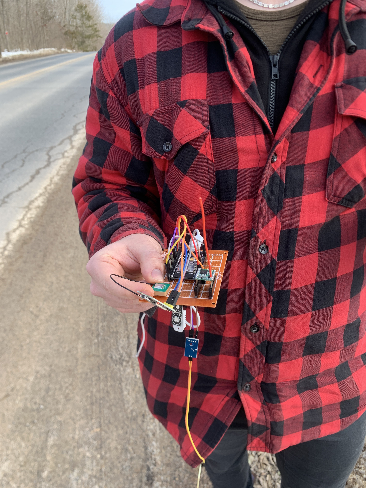
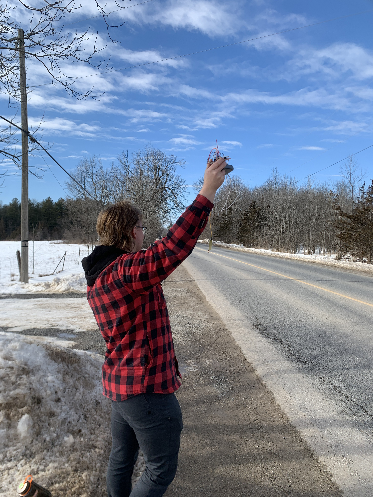
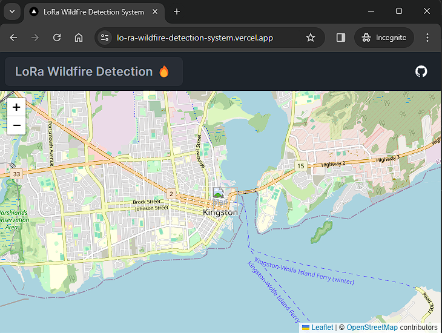
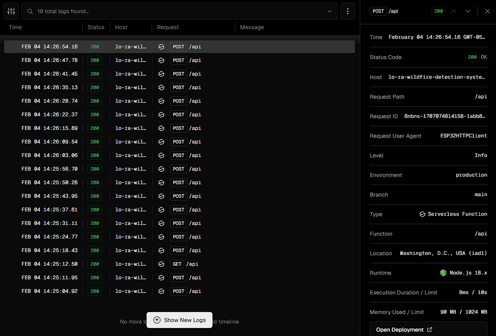

# LoRa Wildfire Detection System
Wildfire detection system using ESP32s as nodes in a distributed Low Power Wide Area (LPWA) network with Long Range (LoRa) radio communication and temperature-humidity sensors.

## Getting Started

### Frontend
To get the webapp working, run the following code:
```
cd frontend
npm install
npm run dev
```

### ESP32 Nodes
1. Download [Arduino IDE](https://www.arduino.cc/en/software).
2. Open Arduino IDE and click Tools > Board > Boards Manager > Search for "esp32" and install "[esp32 by Espressif Systems](https://github.com/espressif/arduino-esp32)".
3. Download [CP210x USB to UART Bridge VCP Windows Drivers](https://www.silabs.com/documents/public/software/CP210x_Windows_Drivers.zip) > Extract all > Run "CP210xVCPInstaller_x64.exe" and follow the instructions.

## Dev Logs
### 1/11/2024
Everyone installed dependencies for interfacing with ESP32s. Wrote code for simple gateway and node LoRa functionality.

### 2/4/2024

Did outdoor testing with a single ESP32 node and gateway. Conrad and Ryan were dropped off in a semi-forested area with an ESP32 node. The ESP32 node broadcasted a signal every two seconds for the gateway. Luka and Matt slowly drove off with the gateway to see how far they could go and still receive signals from the node. The team achieved a node to gateway record distance of 300 meters before losing signal. 🎉

To improve signal range, we decided to look into:
- Increase transmission power to LoRa module to increase signal strength
- Tweak/replace antenna to transmit stronger signal






Web App with navigation bar and leaflet map with a dummy marker set up.



API endpoint was set up. Able to send POST requests from ESP32 gateway node and echo the response back to the gateway.



### 3/1/2024

Added a [Supabase database](https://supabase.com/) to the web application architecture. For now, it stores this information of each node: Temperature, Last update, and Location. The logic for the nodes POST API endpoint was made so the gateway can send a POST request to the API endpoint and it will upsert the data to the database. The web app requests the information of all the nodes in the database every 10 seconds and updates the map accordingly. 

